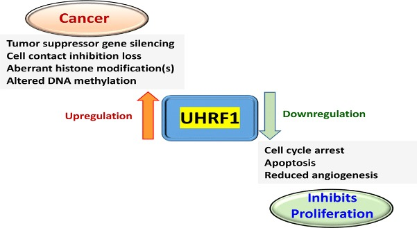
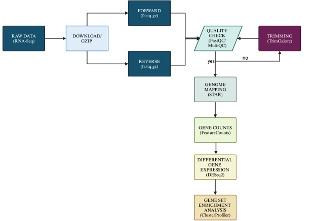
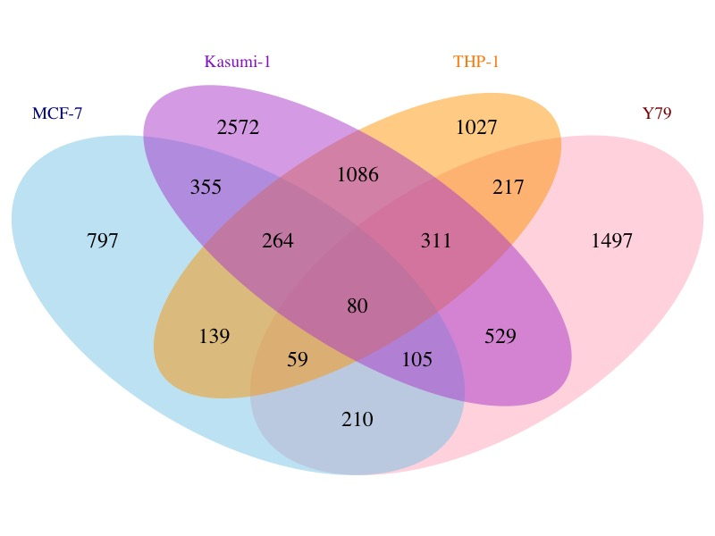
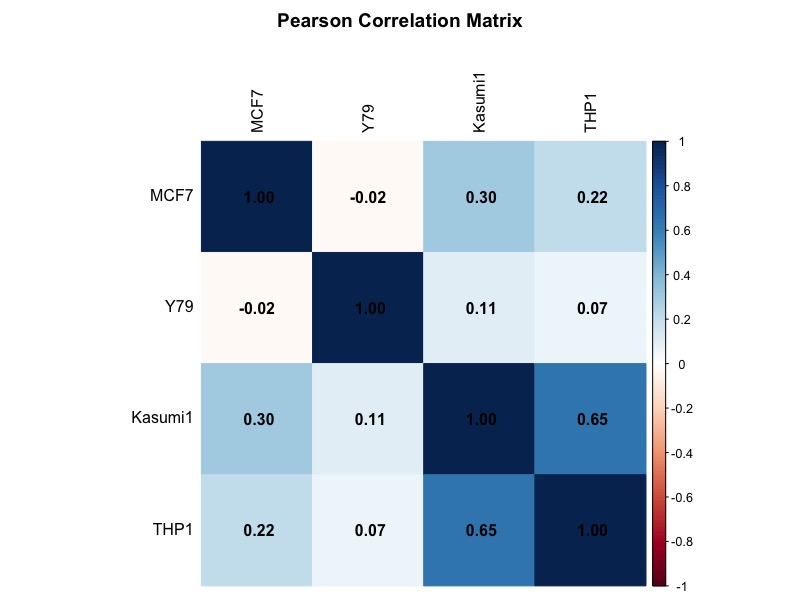

<h1 align="center"> Comparative Transcriptomic Analysis of UHRF1 Knockout in Different Cancer Cell Lines </h1>

## Table of Contents
- [Project Overview](#Project-Overview)
- [Objectives](#Objectives)
- [Methods](#Methods)
  - [Data Acquisition and Screening](Data-Acquisition-and-Screening)
  - [Data Preprocessing](Data-Preprocessing)
  - [Differential Gene Expression Analysis Preprocessing](Differential-Gene-Expression-Analysis-Preprocessing)
  - [Correlation of  Gene expression changes across the different cancer cell lines](Correlation-of-Gene-expression-changes-across-the-different-cancer-cell-lines)
  - [Identification of Protein-Protein Interactions and Hub Genes among the Intersecting Genes](Protein-Protein-Interaction-and-Hub-Genes)
- [Results](#Results)
  - [Analysis of Differentially Expressed Genes in Four Cancer Types](Analysis-of-Differentially-Expressed-Genes-in-Four-Cancer-Types)
  - [Overlap analysis](Overlap-analysis)
  - [Correlation of Gene Expression Profiles Between Cancer Cell Lines After UHRF1 Knockout](Correlation-of-Gene-Expression-Profiles-Between-Cancer-Cell-Lines-After-UHRF1-Knockout)
  - [Gene Set Enrichment Analysis for Overlap DEGs](Gene-Set-Enrichment-Analysis-for-Overlap-DEGs)
  - [Protein-Protein Interaction Network](Protein-Protein-Interaction-Network)
- [Conclusions](#Conclusions)
- [Reccomendation](#Reccomendation)
- [Usage](#Usage)
- [Acknowledgment](#Acknowledgment)
- [Team](#Team)
- [References](#References)
  
## Project Overview

The **UHRF1 (ubiquitin-like with PHD and Ring Finger domains 1)** gene is an important epigenetic regulator that plays a key role in modulating DNA methylation patterns and chromatin structure. 
The UHRF1 gene plays a critical role in cancer progression. Overexpression of UHRF1 has been studied to promote tumorigenesis through different mechanisms, while its knockdown is known to hinder cancer cell migration and induce apoptosis as described in the figure below. ​​The UHRF1 protein has gained considerable attention as a potential biomarker and key regulator in various cancers, though its precise role across different cancer types remains unclear. 
This study thus aims to determine whether UHRF1 downregulation can disrupt common tumor-promoting pathways and simultaneously activate pathways that suppress tumorigenesis in different cancer types. Identifying these mechanisms could reveal new biomarkers and therapeutic targets, expanding treatment options for cancer. 
To do this we analyzed publicly available datasets from Gene Expression Omnibus (GEO) containing RNA sequencing data on cancer cell lines with UHRF1 gene knockout (retinoblastoma (Y79), breast cancer (MCF-7), monocytic leukemia (Kasumi-1) and myeloid leukemia (THP). We performed differential gene expression and gene set enrichment analysis to assess differentially expressed genes (DEGs) and pathway dysregulation resulting from UHRF1 loss. Gene overlap analysis for the detection of shared DEGs across all cell lines was performed, and these shared DEGs were further investigated for functional enrichment and protein-protein interaction. 

Regulation of UHRF-1 gene and its implication in cancer.

## Objectives
### Main Objectives
To elucidate the impact of UHRF1 knockout on global gene expression patterns in leukemia, retinoblastoma, and breast cancer cell lines.

### Specific Objectives
- To perform differential expression analysis of UHRF-1 knockout data obtained from GEO database for leukemia, retinoblastoma, and breast cancer cell lines. 
- To analyze and compare the differential gene expression profiles on the obtained cancer cell lines during UHR1 knockout.
- To identify commonly expressed genes during UHRF-1 knockout in leukemia, retinoblastoma, and breast cancer cell lines.
- To identify key biological processes, molecular pathways and protein-protein interactions(PPI) impacted by UHRF1 knockout.

### Workflow
The image below describes the analysis pipeline used in this study.

## Methods
### Data Acquisition and Screening
* Data for this study was sourced from NCBI’s Gene Expression Omnibus (GEO) database to align with our research objectives. To ensure consistency, we applied filters for “Homo sapiens” and the study type “Expression profiling by high throughput sequencing”. 
* After screening for datasets that compared UHRF1 knockout versus control cancer cell lines, we selected GSE248620, GSE141781, and GSE181519, which include RNA-seq data for MCF-7, Y79, Kasumi-1, and THP-1 cells.

### Data Preprocessing
* To assess raw RNA-seq data quality, FastQC (v0.11.6) was used, checking parameters like GC content, read length, and adapter contamination.
* Reads were then aligned to the hg38 human reference genome using STAR, facilitating accurate mapping.
* Post-alignment, featureCounts (Liao et al., 2013) quantified mapped reads with Ensembl release 38 annotation, ensuring precise read assignment to gene features.

### Differential Gene Expression Analysis
* Gene expression count data was imported into R and processed with DESeq2 to identify differentially expressed genes (DEGs) between UHRF1 knockout and control groups.
* Low-count genes were filtered out, and a threshold of 0.05 was applied to identify significant DEGs.
* We also applied regularized log transformation (rlog) to reduce data variability and used PCA to visualize sample separation based on treatment effects.

### Enrichment Analysis
* For functional insights, gene set enrichment analysis explored pathways and biological processes related to DEGs across the four cancer cell lines.
* The clusterProfiler package enabled analysis of Gene Ontology (GO) and KEGG pathways, focusing on Biological Process, Molecular Function, and Cellular Component categories.

### Overlap and Correlation Analysis
* Overlapping DEGs across cancer types were identified to explore common gene expression changes.
* We used Fisher's exact test to evaluate the significance of overlaps, which were visualized with a Venn diagram.
* Additionally, Pearson correlation analysis of common DEGs was performed, with a heatmap displaying expression changes across cancer cell lines.

### Protein-Protein Interaction and Hub Genes
* To investigate protein-level interactions, Cytoscape was used to visualize protein-protein interactions (PPIs) among the 80 intersecting genes.
* The STRING database enriched the PPI network, linking proteins to significant biological processes and cancer pathways.
* Finally, CytoHubba’s Maximal Clique Centrality (MCC) identified the top 5 hub genes, providing insights into potential regulatory nodes in cancer progression.
  
### Results 
#### Analysis of Differentially Expressed Genes in Four Cancer Types
We analyzed differential gene expression in cancer cell lines to assess UHRF1 knockout effects. The volcano plot illustrated in Figure 1 shows significant gene expression changes, with genes showing a p-value ≤ 0.05 and a log2 fold change ≥ 1 considered differentially expressed. Results revealed 2009 DEGs in MCF-7 (969 upregulated, 1040 downregulated), 3008 in Y79 (1436 upregulated, 1572 downregulated), 5302 in Kasumi-1 (2384 upregulated, 2918 downregulated), and 3183 in THP-1 (1354 upregulated, 1829 downregulated). 

##### Fig 1. Volcano plot of differential gene expression analysis. a, Acute Monocytic Leukemia cell line THP-1, b, Acute Myeloid Leukemia cell line Kasumi-1, c, Retinoblastoma cell line Y79 and d, Breast cancer cell line MCF-7.  The x-axis represents log2 fold changes in gene expression, and the y-axis represents -log10P. The plot shows significantly upregulated and downregulated genes with the red, blue, and black dots representing DEGs that passed both log2 fold change and p-value cutoff, DEGs that passed only p-value cutoff, and insignificant DEGs respectively. 

The heatmap generated using the R package pheatmap, illustrates the expression levels of the 50 most significant differentially expressed genes (DEGs) across four cancer cell lines: Kasumi-1 (acute myeloid leukemia), THP-1 (acute monocytic leukemia), Y79 (retinoblastoma), and MCF-7 (breast cancer), alongside their corresponding control groups. In the heatmap, individual genes are shown as rows, while the columns represent each sample, with a color scale indicating log2-fold change values that reflect gene regulation. Hierarchical clustering was applied to both genes and samples, revealing distinct expression patterns associated with UHRF1 knockout treatment. Notably, genes that clustered together exhibited coordinated expression changes, suggesting potential functional relationships linked to the treatment condition.

##### Fig 2. A heatmap of 50 DEGs highlighted expression patterns across treatment and control groups (Fig 2)

#### Overlap analysis
We analyzed overlapping DEGs among four cancer cell lines to identify shared expression patterns. A Venn diagram illustrated the extent of overlap, revealing each cell line’s distinct DEG set while highlighting commonalities. Pairwise comparisons between cell lines helped us examine associations between gene expression profiles for each cancer phenotype, with Fisher's Exact Test yielding highly significant p-values (< 2.2e-16) across all comparisons. This indicated a strong association in gene expression changes across different cancers. When analyzing the combined dataset of all four cancer phenotypes, the significant p-value confirmed consistent shared DEGs, underlining potential common pathways influenced by UHRF1 knockout across diverse cancers.

##### Fig 3. The Venn diagram displays the overlap of DEGs across four cancer cell lines: breast cancer (MCF-7), retinoblastoma (Y79), acute myeloid leukemia (Kasumi-1), and acute monocytic leukemia (THP-1). Each section represents the DEGs for one cancer type, with intersecting areas highlighting genes shared between two or more phenotypes.

#### Correlation of Gene Expression Profiles Between Cancer Cell Lines After UHRF1 Knockout
The Pearson correlation analysis on the log2 fold changes of 80 overlapping genes across four cancer cell lines (MCF7, Y79, Kasumi1, THP1) showed that the highest correlation was between THP1 and Kasumi1 (r = 0.649), suggesting significant gene expression overlap. MCF7 and Kasumi1 showed a moderate correlation (r = 0.301), while MCF7 had weak correlations with THP1 (r = 0.220) and nearly none with Y79 (r = -0.022). Y79 generally showed low correlations with other lines, indicating distinct expression dynamics across the cell lines, with THP1 and Kasumi1 being the most similar.

##### Fig 4. Overlap of Differentially Expressed Genes Across all Four Cancer Cell lines. The Venn diagram illustrates the overlap of differentially expressed genes (DEGs) between the breast cancer (MCF-7), retinoblastoma (Y79), Acute Myeloid Leukemia (Kasumi-1), and Acute Monocytic Leukemia (THP-1) cell lines. Each set represents the DEGs identified for a specific cancer phenotype, with intersecting regions showing shared genes between two or more phenotypes. 

#### Gene Set Enrichment Analysis for Overlap DEGs
The gene ontology (GO) enrichment analysis on the 80 overlapping DEGs from the four cancer cell lines, identified 179 enriched GO terms across biological processes, cellular components, and molecular functions. The most significant enrichments included "response to lipid" (GO:0033993, p = 0.001196) and "response to inorganic substance" (GO:0010035, p = 0.000525) in the Y79 (retinoblastoma) cell line, highlighting its involvement in lipid and chemical processing pathways. The Kasumi-1 leukemia cell line showed enrichment in "transmembrane transport" (GO:0055085, p = 0.000692), indicating a strong link to cellular transport mechanisms, while THP-1 DEGs were enriched in "circulatory system process" (GO:0003013, p = 0.000939), emphasizing its role in circulation-related processes. However, no significantly enriched KEGG pathways were found at a p-value cutoff of 0.05, suggesting the overlapping genes may not correspond to well-defined metabolic or signaling pathways.

##### Fig 4.  Pearson Correlation Heatmap of Gene Expression Profiles Across Four Cancer Cell Lines. The heatmap displays Pearson correlation coefficients for log2 fold changes of 80 overlapping genes across MCF7, Y79, Kasumi-1, and THP-1 cell lines. Darker colors represent stronger correlations. Kasumi1 and THP1 show the highest positive correlation (r = 0.649), while MCF7 and Y79 exhibit minimal correlation (r = -0.022), reflecting distinct expression profiles between these lines.

#### Protein-Protein Interaction Network
The protein-protein interaction analysis of the 80 common genes revealed a network with 79 nodes and 42 edges, indicating that 37 genes had no interactions within this network. These interactions may contribute to common biological processes across various cancer types during UHRF1 knockout. Utilizing the MCC ranking from the cytoHubba plugin, we identified the top five hub genes: Glucose-6-phosphate 1-dehydrogenase (GPI), Superoxide dismutase 2 (SOD2), Glutamine Synthetase (GLUL), Heat shock protein D1 (HSPD1), and Thioredoxin reductase 1 (TXNRD1), with GLUL and SOD2 exhibiting the highest functional interactions. All enriched GO terms associated with the overlapping DEGs were categorized into Biological Processes (BP), Cellular Components (CC), and Molecular Functions (MF), emphasizing the biological relevance of the protein-protein interactions. Significant biological processes included organic substance transport and positive regulation of apoptotic processes, while the active cellular locations were primarily the cytoplasm and membrane-enclosed lumen, with protein binding identified as the main molecular function attributed to these interactions.

##### Fig 5. The nodes (small circles), represent the protein product of the 80 shared genes, and their interactions with other proteins in the network are connected by edges (lines). The edges vary in thickness indicating the strength of the interaction. Yellow colored nodes indicate the hub genes within the network.

##### Fig 6. Hub genes in PPI network. The top 5 hub genes (TXNRD1, SOD2, GPI, HSPD1, and GLUL) were selected based on their MCC score with varying colors ranging from light-yellow to light-brown. As the colors darken, the MCC score increases, reflecting the strength of the functional interaction between the proteins in the network. 

## Key findings
- Our analysis revealed distinct patterns of differentially expressed genes (DEGs) in each cancer type, with Y79, Kasumi-1, THP-1, and MCF-7 showing varying numbers of DEGs after UHRF1 knockout. 
- Gene overlap analysis identified 80 DEGs across all four cancer types and highlighted critical regulatory pathways 
- PPI network analysis with the 80 overlapping genes revealed 5 key functional genes GPI, SOD2, HSPD1, TXNRD1, and GLUL across the understudy cancer types during UHRF1 knockout.

## Conclusions 
The identification of commonly differentially expressed genes during UHRF1 downregulation is essential for understanding pathways affecting cancer cell survival in UHRF1-targeted therapies. Our study found that certain genes, including GPI, SOD2, HSPD1, TXNRD1, and GLUL, were activated across cancer types during UHRF1 knockout. These genes’ upregulation, linked to poor prognosis in prior studies, suggests that while UHRF1 knockdown may sometimes improve prognosis, this adaptive gene response might reduce its overall therapeutic benefit. These findings raise important questions about the complexity of UHRF1-targeted cancer treatments.

## Recommendations
**In vitro and in vivo studies** would be recommended to understand the molecular mechanisms by which UHRF1 influences these distinct processes across different cancer types. Specifically, it is important to look at how UHRF1-targeted therapies regulate these pathways 

## Usage
This documentation and tutorials outline how to use the pipeline to perform analysis in this study. 

## Acknowledgement
The authors thank the National Institutes of Health (NIH) Office of Data Science Strategy (ODSS) for their immense support before and during the October 2024 Omics codeathon organized in collaboration with the African Society for Bioinformatics and Computational Biology (ASBCB).

## Team
1. Jonathan Kalami
2. Miriam Eyram Lawson Gakpey
3. Benson R. Kidenya
4. Sala Kotochi
5. Benthai Benjamin
6. Nana Yaa Agyemang Karikari
7. Olaitan I. Awe

## References
1. De Almeida, B. P., Apolónio, J. D., Binnie, A., & Castelo-Branco, P. (2019). Roadmap of DNA methylation in breast cancer identifies novel prognostic biomarkers. BMC Cancer, 19(1). https://doi.org/10.1186/S12885-019-5403-0
2. Geissler, F., Nesic, K., Kondrashova, O., Dobrovic, A., Swisher, E. M., Scott, C. L., & J. Wakefield, M. (2024). The role of aberrant DNA methylation in cancer initiation and clinical impacts. Therapeutic Advances in Medical Oncology, 16. https://doi.org/10.1177/17588359231220511
3. Kanwal, R., & Gupta, S. (2012). Epigenetic modifications in cancer. Clinical Genetics, 81(4), 303. https://doi.org/10.1111/J.1399-0004.2011.01809.X
4. Moore, L. D., Le, T., & Fan, G. (2012). DNA Methylation and Its Basic Function. Neuropsychopharmacology 2013 38:1, 38(1), 23–38. https://doi.org/10.1038/npp.2012.112

