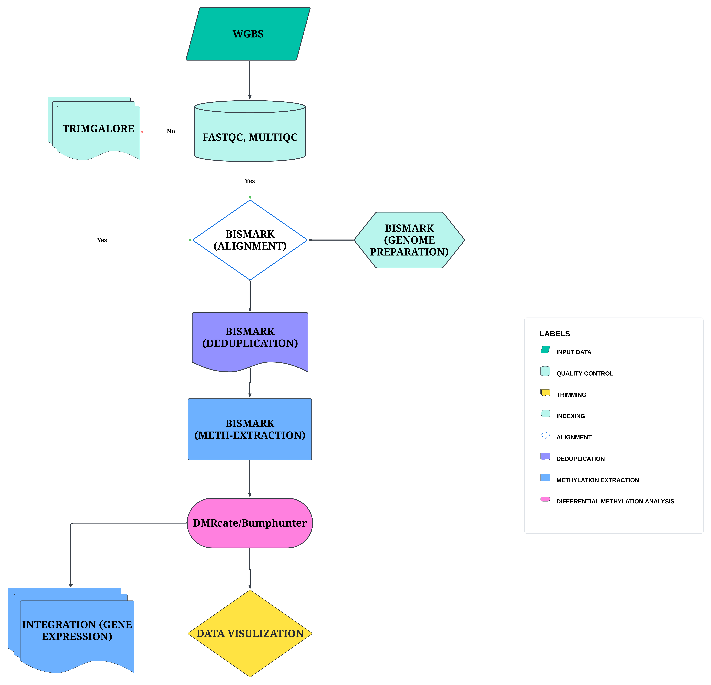

# Uncovering the Role of UHRF1-Mediated DNA Methylation and Gene Expression Alterations in Breast Cancer Metastasis and Drug Resistance: An In-silico Study

## Table of Contents
- [Background](#Background)
- [Objectives](#Objectives)
- [Methods](#Methods)
- [Results](#Results)
- [Acknowledgment](#Acknowledgment)
- [Team](#Team)
- [References](#References)

## Background
Breast cancer ranks as the foremost cause of cancer-related mortality among women worldwide, comprising 12% of the global cancer burden (Sedeta et al., 2023). Its pathogenesis involves an intricate interplay between genetic and epigenetic alterations, with mounting evidence underscoring the pivotal role of DNA methylation in disease onset (Kanwal & Gupta, 2012; Thakur et al., 2022). 

**DNA methylation** involves adding a methyl group to the DNA and plays a crucial role in regulating gene expression, maintaining genomic stability, and controlling cell differentiation (Moore et al., 2012). Aberrant DNA methylation patterns, such as the hypermethylation of tumour suppressor genes and hypomethylation of oncogenes, are characteristic features of cancer. These epigenetic alterations can result in gene silencing or activation, thereby contributing to tumorigenesis (Geissler et al., 2024). Elucidating these methylation changes offers valuable insights into the molecular mechanisms of breast cancer and can aid in identifying potential biomarkers for diagnosis, prognosis, and therapeutic targets (De Almeida et al., 2019).

## Objectives
- To identify the methylation differences in the MCF-7 breast cancer cell line with UHRF1 gene knockout compared to controls.
- To compare the global DNA methylation profiles between UHRF1-shRNA treated and scramble-shRNA treated MCF-7 cells.
- To pinpoint specific differentially methylated regions (DMRs) associated with UHRF1 gene knockdown in the MCF-7 cell line.
- To explore the potential impact of identified methylation changes on key oncogenic pathways and cellular processes in breast cancer.
- To correlate DNA methylation changes with gene expression alterations to understand the epigenetic regulation by UHRF1 in breast cancer cells.

## Methods
Bisulphite mapping and methylation calling was performed on the whole genome bisulfite sequences (WGBS). Global methylation analysis was performed to compute the percent methylation of methylated sites. DMR analysis was then carried out on the bisulfite-seq.

### Workflow

#### Methylation Pipeline 

#### Gene Expression Pipeline

## Results

#### Fig: PCA plot of top 500 most variable genes

#### Fig: MA plot

#### Fig: Dispersion plot

#### Fig: Heatmap of displaying 50 most significant DEGs of both control and treatment group

#### Fig: Volcano plot of gene fold change and p-value

#### Fig: Gene ontology of cellular components 

#### Fig: KEGG plot showing pathways that genes are enriched in

## Acknowledgement
The authors thank the National Institutes of Health (NIH) Office of Data Science Strategy (ODSS) for their immense support before and during the October 2024 Omics codeathon organized in collaboration with the African Society for Bioinformatics and Computational Biology (ASBCB).

## Team
1. Jonathan Kalami
2. Miriam Eyram Lawson Gakpey
3. Sala Kotochi
4. Benthai Benjamin
5. Benson R. Kidenya
6. Olaitan I. Awe

## References
1. De Almeida, B. P., Apolónio, J. D., Binnie, A., & Castelo-Branco, P. (2019). Roadmap of DNA methylation in breast cancer identifies novel prognostic biomarkers. BMC Cancer, 19(1). https://doi.org/10.1186/S12885-019-5403-0
2. Geissler, F., Nesic, K., Kondrashova, O., Dobrovic, A., Swisher, E. M., Scott, C. L., & J. Wakefield, M. (2024). The role of aberrant DNA methylation in cancer initiation and clinical impacts. Therapeutic Advances in Medical Oncology, 16. https://doi.org/10.1177/17588359231220511
3. Kanwal, R., & Gupta, S. (2012). Epigenetic modifications in cancer. Clinical Genetics, 81(4), 303. https://doi.org/10.1111/J.1399-0004.2011.01809.X
4. Moore, L. D., Le, T., & Fan, G. (2012). DNA Methylation and Its Basic Function. Neuropsychopharmacology 2013 38:1, 38(1), 23–38. https://doi.org/10.1038/npp.2012.112

